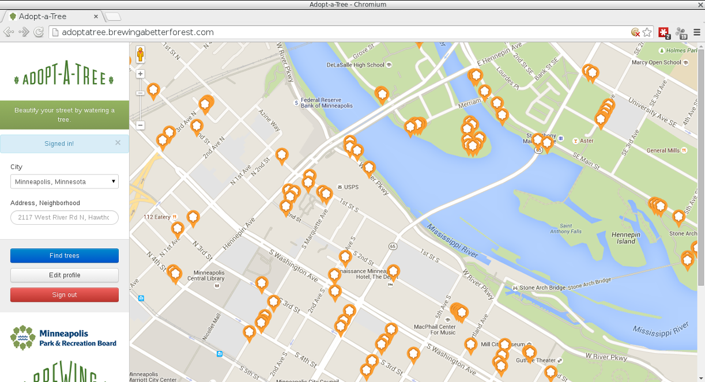

 Adopt-a-Tree

[](https://travis-ci.org/OpenTwinCities/adopt-a-tree)
[](https://codeclimate.com/github/OpenTwinCities/adopt-a-tree)
[](https://codeclimate.com/github/OpenTwinCities/adopt-a-tree)

[travis]: https://travis-ci.org/OpenTwinCities/adopt-a-tree
[code-climate]: https://codeclimate.com/github/OpenTwinCities/adopt-a-tree

Beautify your street by watering a tree.

## Screenshot


## See It Online

Production is at <http://adoptatree.brewingabetterforest.com/>

Stage is at <http://adoptatree-mpls-stage.opentwincities.org/>

## Code of Conduct

As an Open Twin Cities project, the [Open Twin Cities Code of Conduct](http://opentwincities.org/about/code-of-conduct/) 
is in effect regarding online and offline project activities.

Open Twin Cities is dedicated to a harassment-free community for everyone. Be 
kind to one another. Do not insult or put down other community members. Behave 
civilly.

## Installation (Easy Way)
The easy way of setting up Adopt-a-Tree is by using Docker to set up a virtual
environment on your computer.

### Windows Users
Installing Ruby on Rails directly in Windows is extremely difficult, and very
few people know how to do it.  It's best to install [VirtualBox](https://www.virtualbox.org/)
and create a Linux virtual machine for your Ruby on Rails installation.
Once you have done this, you can follow the instructions below for setting
up Adopt-a-Tree in the Linux environment and bypass the need to learn the
Windows way.

### Install Git
Install [Git](http://www.git-scm.com/) on your computer.  If you are using Linux,
just use your routine package manager (such as Apt-Get for Debian and Ubuntu) to
install Git.  If you are using OS X, just download Git from the [Git](http://www.git-scm.com/)
web site and follow the normal software installation procedure.

### Install Docker
Install [Docker](https://www.docker.com/) on your computer.  If you have a
64-bit host system (whether OS X or Linux), go to the [Docker](https://www.docker.com/)
web site and follow the instructions.  If you have a 32-bit Linux host, go to
[https://github.com/jhsu802701/docker-32bit-debian-jessie-install](https://github.com/jhsu802701/docker-32bit-debian-jessie-install)
and follow the instructions.

### Starting Docker
* Create the directory OpenTwinCities on your computer.
* Use the cd command to enter the OpenTwinCities directory, and enter the following commands:
```
git clone https://github.com/OpenTwinCities/docker-debian-jessie.git
cd docker-debian-jessie
sh rbenv-adoptatree.sh # Use 32rbenv-adoptatree.sh instead if using a 32-bit system
cd rbenv-adoptatree
sh download_new_image.sh
```
* After the Docker image has been downloaded, you will be in your Docker container.
Note that the contents of the shared directory are accessible through your Docker
container AND through your host system.  You can enter commands in your Docker container
and edit files in the shared directory through your preferred editor on your host system.
* OPTIONAL: Run the test scripts in the shared directory to set up basic starter
Rails apps.  These are the sanity checks used for making sure that the development
environment in the Docker container is working properly.
  
### Starting Adopt-a-Tree
* Go to the /home/winner/shared directory, and enter the following commands:
```
git clone https://github.com/OpenTwinCities/adopt-a-tree.git
cd adopt-a-tree
sh build_fast.sh
```
* The build_fast.sh script installs the gems, configures the PostgreSQL database,
and runs the tests.  This process takes just a few minutes.  If all goes well, all
of the tests will pass.
* After you have set up Adopt-a-Tree, you are ready to start working on the project.
Use the tmux command to open any additional windows you need for simultaneous tasks, 
such as running the local server and running the Rails sandbox.  Press "Ctrl-B" and 
then "c" to create a new tmux window.  Enter "Ctrl-B" and then "p" to switch to the 
previous tmux window.  Press "Ctrl-B" and then "n" to switch to the next tmux window.
To get rid of a tmux window, terminate any tasks running within it, and enter the 
command "exit".

### Exiting the Docker Container
* In the Docker container, close all extra tmux windows.  After you have done this,
enter "exit" again to leave tmux.  Then enter "exit" one more time to exit the
Docker container.
* To re-enter the Docker container, run the resume.sh script.

### Resetting the Docker Container
* Follow the above procedure for exiting the Docker container.
* To reset as well as re-enter the Docker container, run the reset.sh script.
This returns the Docker container to the original conditions provided by the
Docker image.
* To set up Adopt-a-Tree in the rebuilt Docker container, use the build_fast.sh
script again.

### Updating the Docker Image
* Follow the above procedures for exiting the Docker container.
* Use the download_new_image.sh script to erase the current Docker image and
download the latest version to replace it.

## Installation (Difficult Way)

The difficult way is setting Adopt-a-Tree directly on your computer's host OS.

### System Dependencies

- [Git](http://www.git-scm.com/)
- [Postgres](http://www.postgresql.org/) plus development header files
- [Node.js](https://nodejs.org/)
- [libffi](https://en.wikipedia.org/wiki/Libffi)

**Mac OS X**

```
ruby -e "$(curl -fsSL https://raw.githubusercontent.com/Homebrew/install/master/install)"
brew install git postgres node 
```

Note in the above we are fetching [Homebrew](http://brew.sh/) to handle system
dependencies.

**Ubuntu/Debian**

```
sudo apt-get install git postgresql libpq-dev nodejs nodejs-legacy npm libffi-dev
```

**Fedora/RHEL/CentOS**

```
sudo yum install git postgresql-server postgresql-devel nodejs npm libffi-devel patch 
sudo postgresql-setup initdb && sudo systemctl enable postgresql.service && sudo service postgresql start
```

#### Prep the Database

**Mac OS X**

First, open another terminal and start the database:

```
postgres -D /usr/local/var/postgres
```

Then, create the adopta database user

```
createuser -d adopta
```

**Linux**

```
sudo -u postgres createuser -d adopta
```

As superuser, edit:

- `/etc/postgresql/{version number}/main/pg_hba.conf` in Ubuntu/Debian, or 
- `/var/lib/pgsql/data/pg_hba.conf` in Fedora

Find one of these lines:

```
local   all             postgres                                peer
local   all             all                                     peer
```

and add the following line right above it:

```
local   all             adopta                                  trust
```

Now, save and restart Postgres:

```
sudo service postgresql restart
```

### PhantomJS

[PhantomJS](http://phantomjs.org/) is used by tests

```
npm install -g phantomjs
```

### rbenv

rbenv and it's pluggins are installed via Git. Below are commands to run in
OS X or Linux for installing rbenv and a couple of useful plugins.

(Note that some systems use `~/.bash_profile` instead of `~/.bashrc`. Running
`ls -a ~ | egrep '(.bash_profile|.bashrc)'` should tell you which one to use.)

```
git clone https://github.com/sstephenson/rbenv.git ~/.rbenv
echo 'export PATH="$HOME/.rbenv/bin:$PATH"' >> ~/.bashrc
echo 'eval "$(rbenv init -)"' >> ~/.bashrc
source ~/.bashrc
git clone https://github.com/sstephenson/ruby-build.git ~/.rbenv/plugins/ruby-build
git clone https://github.com/sstephenson/rbenv-gem-rehash.git ~/.rbenv/plugins/rbenv-gem-rehash
```

### Get the Repo

```
git clone https://github.com/ballPointPenguin/adopt-a-tree.git
cd adopt-a-tree
```

### Install the Ruby

First, find out what version of Ruby Adopt-a-Tree runs in

```
rbenv version
```

Then, install whatever version of Ruby the above command just returned. This
part might take some time. 

```
rbenv install <version number> -k
```

### Install Gems and Create the Adopt-A-Tree Database

```
gem install bundler
bundle install
bundle exec rake db:create
bundle exec rake db:schema:load
bundle exec rake db:seed
```

### Additional Installation Resources

In case you have trouble with the above installation steps, you might want to
refer to the [Adopt-a-Hydrant Wiki](https://github.com/codeforamerica/adopt-a-hydrant/wiki/Adopta-Install-Notes) 
for detailed instructions on installation. You can also post a question to the
[Open Twin Cities Google Group](https://groups.google.com/forum/#!forum/twin-cities-brigade).


## Usage

```
rails server
```

## Importing More Trees

Once or twice a year, the Minneapolis Park Board sends us a shapefile full of
trees to upload to Adopt-A-Tree. Here is the process for putting those on the
site:

1. Upload the shapefile to Open Twin Cities' Open Data Portal
2. Download a JSON version of the file from Open Twin Cities' Open Data Portal
3. Copy the JSON file to the Adopt-A-Tree server, using user `ubuntu`. Bill has
   keys.
4. Log into the Adopt-A-Tree server using user `ubuntu`
5. Back up the database using `pg_dump adopta_production > SOMEFILENAME`. You'll
   need to change users.
6. Open a rails console for production.
7. Delete all trees that have not been adopted `Thing.where(user_id: nil).destroy_all`
8. Exit the console, run rake db:trees:list_fields on the JSON file (see below)
9. run rake db:trees:import. Be sure RAILS_ENV=production.
10. Open a production rails console again and verify the trees have been imported.
11. Restart Adopt-A-Tree if the process died during the import.

When running `rails` or `rake`, you'll need to prepend `RAILS_ENV=production bundle exec`

### Rake Tasks

Three rake tasks are available to help you import additional trees to the 
database, or to replace all tree data, from a GeoJSON file provided by Socrata.

To view a list of the names and indices of all fields in a file, run `rake db:trees:list_fields[PATH_TO_GEOJSON]`.
PATH_TO_GEOJSON can be relative or absolute.

```
$ rake db:trees:list_fields[db/trees.json]
0 - :sid
1 - :id
2 - :position
.
.
.
64 - x
65 - y
66 - species
```

For the import and replace tasks, you're going to need to know the column indices
for the 'id' (**not** :id), 'uniqueid', 'x', 'y', and 'species' columns.

To import additional trees into the database from a GeoJSON files, run `rake db:trees:import[PATH_TO_GEOJSON,ID_INDEX,UNIQUEID_INDEX,X_INDEX,Y_INDEX,SPECIES_INDEX]`:

```
rake db:trees:import[db/trees.json,8,9,64,65,66]
```

To completely replace the trees currently in the databse with the trees contained
in a GeoJSON file, run `rake db:trees:replace[PATH_TO_GEOJSON,ID_INDEX,UNIQUEID_INDEX,X_INDEX,Y_INDEX,SPECIES_INDEX]`:


```
rake db:trees:replace[db/trees.json,8,9,64,65,66]
```

## Deploying

Assuming you have SSH keys setup properly, deploy via:

    cap stage deploy
    cap production deploy

## Accessing Admin View

*Based on [Raleigh's Adopt-A-Hydrant installation notes](http://localwiki.net/raleigh/Adopta_App/Development?&docuredirected_from=raleigh%20adopta%20app/development).*

1. First, signup through the site.
2. Then open a terminal and start the rails console - `rails console`.
3. List all users - `User.all`
4. Find your user id in the list. For this example, assume it is '1'.
5. Search for your user - `a=User.find(1)`
6. Set the admin flag on your user - `a.admin = true`
7. Save your user - `a.save`
8. Go back to your browser, and visit localhost:3000/admin

## How to Contribute Code

So you want to help out on Adopt-A-Tree? You're awesome, and we're happy to 
help you be as awesome as possible.

In the spirit of [free software][free-sw], **everyone** is encouraged to help
improve this project. So ways to contribute code include:

* by writing specifications/tests
* by writing code (**no patch is too small**: fix typos, add comments, clean up
  inconsistent whitespace)
* by forking and sending pull requests
* by refactoring code

[free-sw]: http://www.fsf.org/licensing/essays/free-sw.html

<a name="contrib_code_basics"></a>
### The Basics

First things first, there are a few things you should be familiar with:

 - The Command Line. Depending on your computer and the tools you use, you 
   might use the command line a little or a lot. Either way, it helps to know 
   how to use it a bit. 
    - Never used the Command Line before? Check out [this tutorial from Open Hatch to get started](http://openhatch.org/missions/shell/about).
    - Using Windows? Open Hatch also has [a tutorial focused on the Windows command line](http://openhatch.org/missions/windows-setup/).
 - Git and GitHub. Adopt-A-Tree uses these tools to manage our collaborative 
   coding. If you've never used git or GitHub before, you can search the 
   Internet and find a lot of good resources. You can also checkout these 
   couple of tutorials to get started:
    - [Install and Setup Git](https://help.github.com/articles/set-up-git/)
    - [GitHub's Hello World](https://guides.github.com/activities/hello-world/),
      which covers the on the standard flow for contributing code to projects on GitHub. 
  - Most of Adopt-A-Tree is written in [Ruby](https://www.ruby-lang.org/en/) and 
    [JavaScript](https://developer.mozilla.org/en-US/docs/Web/JavaScript), 
    using [Rails](http://rubyonrails.org/) and [jQuery](http://jquery.com/). 
    Familiarity with other frameworks and libraries, such as [Sinatra](http://www.sinatrarb.com/) 
    (Ruby) and [Ember](http://emberjs.com/) (JavaScript) might also be helpful.
    And of course, [HTML](https://developer.mozilla.org/en-US/docs/Web/HTML) and 
    [CSS](https://developer.mozilla.org/en-US/docs/Web/CSS).

Don't worry if you're not comfortable with all of these things. Working on a 
project like Adopt-A-Tree is a great way to learn.

<a name="contrib_code_process"></a>
### The Process

Are you ready to contribute? Well, here's how:

1. [Fork the repository.][fork]
2. [Clone your fork to your computer](https://help.github.com/articles/fork-a-repo/#step-2-create-a-local-clone-of-your-fork)
3. Get it running on your computer. There are a couple of tutorials for 
   installing on Linux (https://github.com/codeforamerica/adopt-a-hydrant/wiki/Adopta-Install-Notes), 
   and the process is pretty similar for OS X.
4. Find an issue and start working on it at https://github.com/ballPointPenguin/adopt-a-tree/issues
   - Be sure to make comments and ask questions on the issues.
   - We've prioritized issues into milestones, so please checkout the 
     milestones to see what should get done next.
5. [Create a topic branch.][branch]
6. Add specs for your unimplemented feature or bug fix.
7. Run `bundle exec rake test`. If your specs pass, return to step 6.
8. Implement your feature or bug fix.
9. Run `bundle exec rake test`. If your specs fail, return to step 8.
10. Run `open coverage/index.html`. If your changes are not completely covered
   by your tests, return to step 6.
11. Add, commit, and push your changes.
12. [Submit a pull request.][pr]

[fork]: http://help.github.com/fork-a-repo/
[branch]: http://learn.github.com/p/branching.html
[pr]: http://help.github.com/send-pull-requests/

<a href="contrib_code_meetups"></a>
### Meetups and Getting Help

Open Twin Cities holds [lots of events that everybody is welcome to](http://opentwincities.org/events/). 
Our monthly meetups in Minneapolis and St. Paul are great places to come 
discuss Adopt-A-Tree, ask questions, and get some help.

We also have online ways to discuss and ask questions about Adopt-A-Tree. Join 
the [Open Twin Cities Google Group](https://groups.google.com/forum/#!forum/twin-cities-brigade) 
to discuss Adopt-A-Tree with civic technologists all around the Twin Cities. 
You can also pose questions and submit problems and ideas though the 
[issues on GitHub](https://github.com/ballPointPenguin/adopt-a-tree/issues). 
And feel free to email questions and ideas to <contact@opentwincities.org>.

## Additional Ways to Contribute
Here are some non-coding ways *you* can contribute:

* by using alpha, beta, and prerelease versions
* by [reporting bugs][submit_tickets]
* by [suggesting new features][submit_tickets]
* by [translating to a new language][locales]
* by writing or editing documentation
* by closing [issues][]
* by reviewing patches
* [financially][]

[locales]: https://github.com/codeforamerica/adopt-a-hydrant/tree/master/config/locales
[issues]: https://github.com/ballPointPenguin/adopt-a-tree/issues
[financially]: https://givemn.org/project/Open-Twin-Cities


<a name="submit_tickets"></a>
[submit_tickets]: #submit_tickets
## Submitting an Issue or Bug
We use the [GitHub issue tracker][issues] to track bugs and features. Before
submitting a bug report or feature request, check to make sure it hasn't
already been submitted. When submitting a bug report, please include a [Gist][]
that includes a stack trace and any details that may be necessary to reproduce
the bug, including your gem version, Ruby version, and operating system.
Ideally, a bug report should include a pull request with failing specs.

[gist]: https://gist.github.com/

## Google Analytics
If you have a Google Analytics account you want to use to track visits to your
deployment of this app, just set your ID and your domain name as environment
variables:

    heroku config:set GOOGLE_ANALYTICS_ID=your_id
    heroku config:set GOOGLE_ANALYTICS_DOMAIN=your_domain_name

An example ID is `UA-12345678-9`, and an example domain is `adoptahydrant.org`.

## Supported Ruby Version
This library aims to support and is [tested against][travis] Ruby version 2.1.0.

If something doesn't work on this version, it should be considered a bug.

This library may inadvertently work (or seem to work) on other Ruby
implementations, however support will only be provided for the version above.

If you would like this library to support another Ruby version, you may
volunteer to be a maintainer. Being a maintainer entails making sure all tests
run and pass on that implementation. When something breaks on your
implementation, you will be personally responsible for providing patches in a
timely fashion. If critical issues for a particular implementation exist at the
time of a major release, support for that Ruby version may be dropped.

## Copyright
Copyright (c) 2014 Code for America. See [LICENSE][] for details.

[license]: https://github.com/codeforamerica/adopt-a-hydrant/blob/master/LICENSE.md
